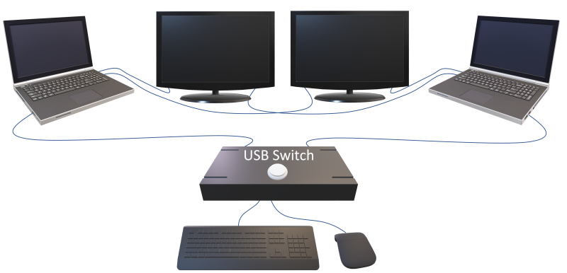
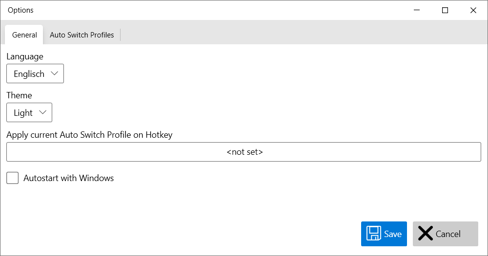
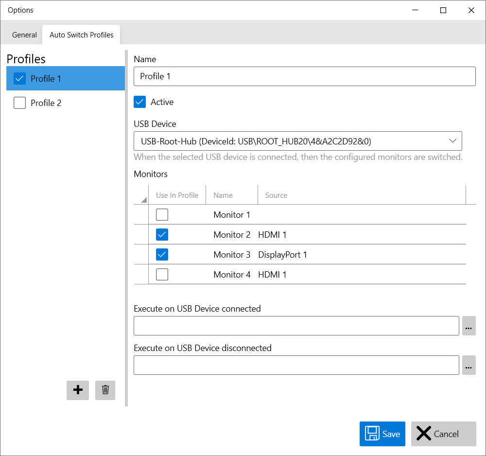

# Convert a cheap USB switch into a KVM-Switch

This Application converts a simple USB switch into a KVM-Switch.

The Application switches monitor input sources depending on a connected USB device. 
Use a simple USB switch to connect your keybord, mouse and other devices to multiple computers. By switching the usb device the configured monitors will be switched too.

The Application adds a new symbol  to the system tray, 
the context menue enables functions like edit configuration or quick change of active profile.

## Configuration

### General

### AutoSwitch Profiles

